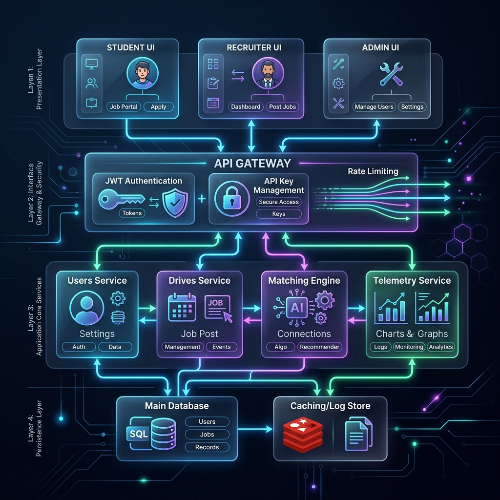
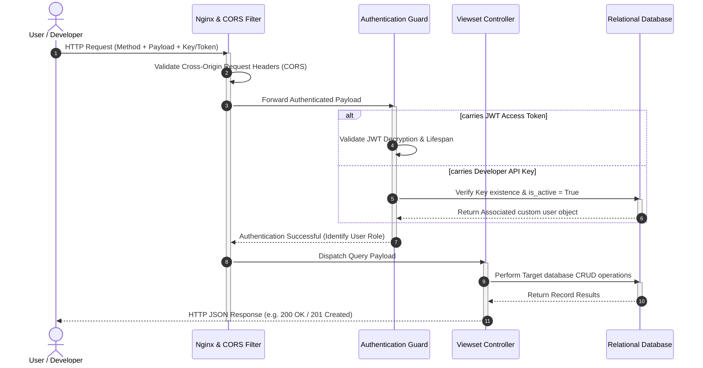

# 📐 High-Level Design (HLD) Document

Welcome to the High-Level Design (HLD) specification for the **Campus Placement Portal**. This document describes the modular architecture, component interactions, security layers, overall technology choices, and data flows governing the platform.

---

## 1. System Goals & Architecture Principles

The Placement Portal is designed to connect three core stakeholder groups: **Students**, **Recruiter Companies**, and **Campus Administrators** while providing secure external data access to **Third-Party Developers**.

### Core Architecture Principles:
* **Separation of Concerns (Decoupled Design):** Clear separation between the Presentation Layer (Client), Interface Gateway (Security & Routing), Application Logic Layer (Service Modules), and the Persistence Layer (Database).
* **Stateless Authenticated Gateways:** No session state is retained on the web servers. All client-to-server calls authenticate dynamically using either **SimpleJWT Bearer Tokens** or persistent **X-API-Keys**.
* **High Efficiency & Telemetry-Driven:** Real-time data calculations (e.g., student match scores, selection ratios) are performed close to the database using optimized aggregations.

---

## 2. High-Level Component Diagram

The following graphic represents the system's architecture layers, core modules, and the flow of request-response data between components:



```mermaid
graph TB
    subgraph Presentation Layer (Client Space)
        U1["🎓 Student Workspace UI"]
        U2["💼 Recruiter Portal UI"]
        U3["🛠️ Admin Console UI"]
        U4["🔌 3rd-Party Dev Integrations"]
    end

    subgraph Security & Routing (Interface Gateway)
        GW["🌐 Nginx / CORS Filter"]
        AUTH["🛡️ Authentication Manager"]
        JWT["🔑 JWT Session Guard"]
        APK["🔒 Developer API Key Guard"]
    end

    subgraph Application Layer (Core Service Modules)
        MOD_USERS["👤 Users & Profiles Manager"]
        MOD_DRIVES["📢 Placement Drives Engine"]
        MOD_APPS["📝 Candidate Pipeline (Applications)"]
        MOD_MATCH["🎯 Smart Recommendation Engine"]
        MOD_ANALYTICS["📊 Telemetry & Reports Engine"]
        MOD_SUPPORT["🔔 Helpdesk & Notifications"]
    end

    subgraph Persistence Layer (Storage Space)
        DB[("🗄️ Relational Database (SQLite / Postgres)")]
    end

    %% Presentation to Gateway Flows
    U1 -->|HTTP Actions + JWT| GW
    U2 -->|HTTP Actions + JWT| GW
    U3 -->|HTTP Actions + JWT| GW
    U4 -->|REST Calls + X-API-Key| GW
    
    %% Gateway to Authentication Filters
    GW --> AUTH
    AUTH --> JWT
    AUTH --> APK
    
    %% Authentication Filters to Core Services
    JWT --> MOD_USERS
    JWT --> MOD_DRIVES
    JWT --> MOD_APPS
    JWT --> MOD_SUPPORT
    
    APK --> MOD_ANALYTICS
    APK --> MOD_DRIVES
    APK --> MOD_MATCH

    %% Core Services to Persistence Layer
    MOD_USERS ==>|ORM Queries| DB
    MOD_DRIVES ==>|ORM Queries| DB
    MOD_APPS ==>|ORM Queries| DB
    MOD_MATCH ==>|Aggregate Scores| DB
    MOD_ANALYTICS ==>|Telemetry Queries| DB
    MOD_SUPPORT ==>|State Storage| DB
```

---

## 3. Technology Stack Choice

| Layer | Technology Choice | Rationale |
| :--- | :--- | :--- |
| **Presentation (Frontend)** | HTML5, Vanilla CSS3, Javascript (ES6+) | Delivers absolute styling flexibility (premium glassmorphism, native dark/light modes) and hardware-accelerated fluid sidebar animations without heavy framework overhead. |
| **Application (Backend)** | Python 3.10+, Django MVT Framework | Provides a robust, secure, and production-tested base with built-in ORM security and rapid REST endpoint building capabilities. |
| **APIs & Serialization** | Django REST Framework (DRF) | Powerful toolkit for building clean, standard-compliant, paginated REST endpoints with automatic JSON parsing and content negotiations. |
| **Authentication** | SimpleJWT & Developer API Keys | Combines secure, short-lived 15-minute browser access tokens with silent auto-refresh loops, alongside persistent keys for server-to-server developer integrations. |
| **Persistence (Database)** | SQLite (Dev) / PostgreSQL (Prod) | Enables effortless zero-config local development, translating seamlessly to enterprise-grade Postgres in production via Django’s ORM driver. |

---

## 4. Main Modules & Subsystems

### 👥 1. Users & Profiles Manager
* **Function:** Oversees account registrations, status verifications (admin approvals), and profile hydration.
* **Responsibilities:** Restricts blacklisted users, saves academic metrics, stores encrypted credentials, and processes digital resumes.

### 📢 2. Placement Drives Engine
* **Function:** Operates job postings, branch restrictions, packages, and eligibility metrics.
* **Responsibilities:** Automatically runs deadline validation checks and enforces minimum academic requirements (CGPA) during candidate onboarding.

### 📝 3. Candidate Pipeline (Applications)
* **Function:** Orchestrates student recruitment stages (Applied, Shortlisted, Selected, Rejected).
* **Responsibilities:** Records Recruiter feedback, updates placement statuses, and enforces one-application-per-drive rule.

### 🎯 4. Smart Recommendation Engine
* **Function:** Computes matching indexes (0-100%) comparing candidate resumes, skill tags, and grades against active job specs.
* **Responsibilities:** Calculates skills gap metrics and lists matched job recommendations dynamically on student analytics boards.

### 📊 Telemetry & Reports Engine
* **Function:** Runs calculations for platorm metrics.
* **Responsibilities:** Aggregates campus placement ratios, average salaries, hiring response rates, and branch distributions in real-time.

### 🔔 5. Helpdesk & Notifications
* **Function:** Connects participants with moderators and handles messaging channels.
* **Responsibilities:** Emits automated notifications to participants upon recruitment updates, support resolutions, or placement confirmations.

---

## 5. High-Level Data Flows

### A. Client Request Lifecycle (User & Developer)
The diagram below shows how a client request carrying authentication credentials moves through the system:



---

## 6. Integration Boundary & External Systems

* **The Browser Storage Boundary:** The client saves JWT tokens and theme selections inside the browser’s `localStorage`. No credentials or passwords are saved or stored in plain-text cookies.
* **The API Key boundary:** Developers query data using `X-API-Key: pp_live_...` headers. All keys are encrypted (hashed) on the server side using the database index.
* **Relational Database Boundary:** Django ORM handles all connections. Transactions are isolated at the database level, ensuring that multi-threaded writes (like simultaneous test runs or student applications) do not corrupt platform state.
