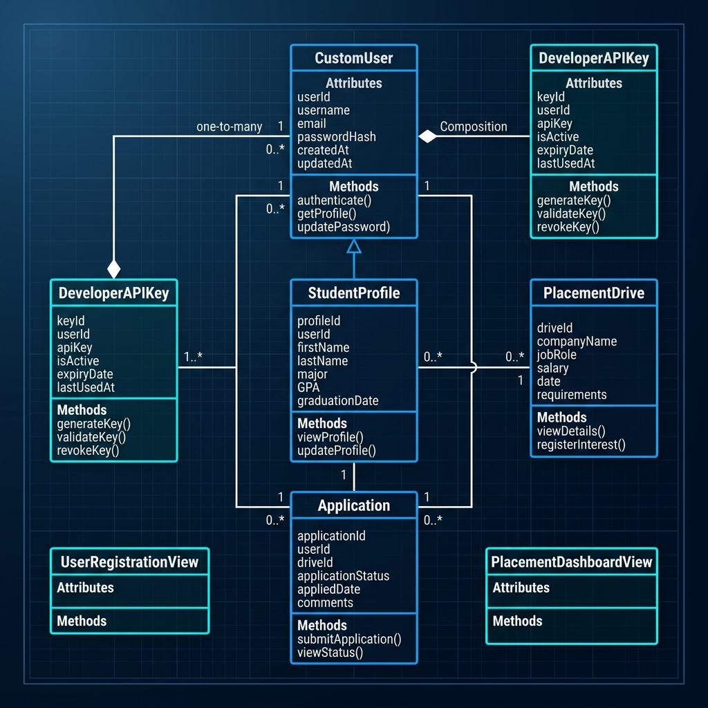
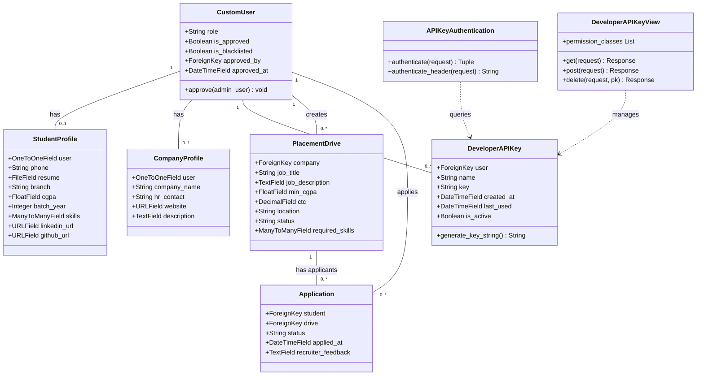

# 📐 Low-Level Design (LLD) Document

Welcome to the Low-Level Design (LLD) specification for the **Campus Placement Portal**. This document provides a code-level blueprint of the database models, API view controllers, authentication middleware classes, and their concrete fields, methods, properties, and associations.

---

## 1. Class Diagram (UML Representation)

The following diagram illustrates the relationship, inheritance, composition, and associations between our backend database tables and API controller services:

---

## 2. Core Database Model Classes

### 👤 `CustomUser` (subclasses Django's `AbstractUser`)
Represents the baseline authenticated account on the platform.
* **Fields:**
  * `role` (`CharField`): Choices: `student`, `company`, `admin`.
  * `is_approved` (`BooleanField`): Dictates if recruiters have campus admin approval.
  * `is_blacklisted` (`BooleanField`): Restricts access if set to `True`.
  * `approved_by` (`ForeignKey` to `CustomUser`): Logs which administrator approved the recruiter account.
  * `approved_at` (`DateTimeField`): Logs verification time.
* **Instance Methods:**
  * `approve(admin_user)`: Approves recruiter account and records auditing logs.

### 🎓 `StudentProfile`
Extends user account for student-specific academic information.
* **Fields:**
  * `user` (`OneToOneField` to `CustomUser`): Associated core account.
  * `phone` (`CharField`): Phone number.
  * `resume` (`FileField`): File path to PDF resume on media disk.
  * `branch` (`CharField`): Branch (e.g. *Computer Science*, *Electrical Engineering*).
  * `cgpa` (`FloatField`): Cumulative grade point average (cutoff metrics).
  * `batch_year` (`IntegerField`): Graduation year.
  * `skills` (`ManyToManyField` to `Skill` model): Student skills profile.
  * `linkedin_url` (`URLField`): Professional networking handle.
  * `github_url` (`URLField`): Code repository link.

### 💼 `CompanyProfile`
Extends user account for corporate recruiters.
* **Fields:**
  * `user` (`OneToOneField` to `CustomUser`): Associated core account.
  * `company_name` (`CharField`): Legal entity name.
  * `website` (`URLField`): Corporate website domain.
  * `hr_contact` (`CharField`): HR contact number.
  * `description` (`TextField`): Profile block.

### 🔑 `DeveloperAPIKey`
Stores persistent developer integration tokens.
* **Fields:**
  * `user` (`ForeignKey` to `CustomUser`): The owner developer of the key.
  * `name` (`CharField`): Custom name string.
  * `key` (`CharField`): Unique hashed credential lookup string.
  * `created_at` (`DateTimeField`): Time of token generation.
  * `last_used` (`DateTimeField`): Updated dynamically on successful request logs.
  * `is_active` (`BooleanField`): Verification state flag.
* **Static Methods:**
  * `generate_key_string()`: Returns a cryptographically secure `pp_live_...` API token.

### 📢 `PlacementDrive`
Represents an active job posting and recruitment event.
* **Fields:**
  * `company` (`ForeignKey` to `CustomUser`): Owner recruiter account.
  * `job_title` (`CharField`): Hiring role title.
  * `job_description` (`TextField`): Eligibility parameters and descriptions.
  * `min_cgpa` (`FloatField`): Academic cutoff constraint.
  * `ctc` (`DecimalField`): Package (LPA).
  * `location` (`CharField`): Working office location.
  * `status` (`CharField`): Choices: `pending`, `approved`, `closed`.
  * `required_skills` (`ManyToManyField` to `Skill` model): Needed criteria skills tags.

### 📝 `Application`
Maps the recruitment funnel between students and drives.
* **Fields:**
  * `student` (`ForeignKey` to `CustomUser`): Applying student.
  * `drive` (`ForeignKey` to `PlacementDrive`): Targeted drive posting.
  * `status` (`CharField`): Funnel choice: `applied`, `shortlisted`, `selected`, `rejected`.
  * `applied_at` (`DateTimeField`): Instant of submission.
  * `recruiter_feedback` (`TextField`): Written evaluation remarks from the interviewer.

---

## 3. Middleware & Core API View Controllers

### 🛡️ `APIKeyAuthentication` (subclasses `BaseAuthentication`)
* **Purpose:** Handles stateless authentication filters across DRF endpoints by checking headers.
* **Methods:**
  * `authenticate(request)`: Parses request headers for `X-API-Key`. If present, validates against `DeveloperAPIKey` table in the database and returns a tuple `(user, key)`.
  * `authenticate_header(request)`: Returns authentication scheme instructions.

### 🔌 `DeveloperAPIKeyView` (subclasses `APIView`)
* **Purpose:** Exposes CRUD operations for key management to students and recruiters.
* **Methods:**
  * `get(request)`: Queries all active `DeveloperAPIKey` records owned by the calling user and returns metadata summaries.
  * `post(request)`: Triggers creation of a new persistent secret key.
  * `delete(request, pk)`: Revokes and soft-deletes a key.
