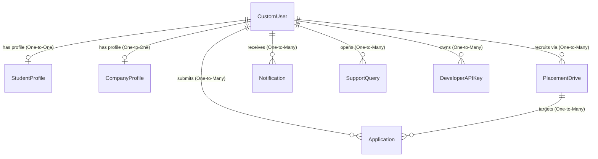

# 🛠️ Technical Documentation

Welcome to the Technical Documentation directory for the **Campus Placement Portal**. This document provides detailed insights into the architecture, database schema, API specifications, local setup, and deployment guides of the application.

---

## 1. Architecture Overview

The system is built on a modern **Decoupled Architecture** leveraging Django's robust MVC/MVT foundations combined with a high-performance stateless REST API powered by Django REST Framework (DRF) and SimpleJWT.

```mermaid
graph TD
    subgraph Client Layer (Frontend)
        A[HTML5 & CSS3 Interface] -->|Stateless JWT Requests| B[AppUI JavaScript Engine]
        B -->|Local Storage Cache| C[(JWT Access/Refresh Tokens)]
        B -->|Developer Integrations| Z[(Developer API Key)]
    end

    subgraph Server Layer (Backend API)
        D[Django Middleware & Cors] --> E[JWT Authentication Guard]
        D --> E2[Developer API Key Auth]
        E --> F[DRF Permission Gatekeeper]
        E2 --> F
        F --> G[Django REST Viewsets]
        G --> H[Model Layer & ORM]
    end

    subgraph Storage Layer (Database)
        H --> I[(SQLite / PostgreSQL Database)]
    end
```

### Key Architectural Pillars:
* **Stateless API Interactions:** All user actions (dashboards, list fetches, application submissions, support replies) execute via fetch requests carrying an `Authorization: Bearer <JWT_TOKEN>` header.
* **Flicker-Free Theme Engine:** Theme changes (`dark`/`light` modes) are managed via immediate head-injection scripts reading from `localStorage` to eliminate rendering layout flashes.
* **Compositor Accelerated GPU Animations:** Collapsible sidebar navigations utilize transition rules configured with CSS `will-change` parameters to run operations directly on GPU composition threads.

---

## 2. Database Schema Documentation

The data layer consists of several critical tables mapped natively by Django's Object-Relational Mapper (ORM).

### Entity Relationship Model



### Table Mappings & Constraints

#### 1. `users_customuser` (Custom User Model)
* **Description:** Represents authenticated users on the platform (Students, Recruiter Companies, Admins).
* **Fields:**
  * `id` (`integer`, Primary Key, Auto-Increment)
  * `username` (`varchar(150)`, Unique)
  * `email` (`varchar(254)`, Unique)
  * `role` (`varchar(10)`, Choice: `student`, `company`, `admin`)
  * `is_approved` (`boolean`, default `true` for students, `false` for recruiters)
  * `is_superuser` / `is_staff` (`boolean`)

#### 2. `users_studentprofile`
* **Description:** Extends custom user for students.
* **Fields:**
  * `id` (`integer`, Primary Key)
  * `user_id` (`integer`, Foreign Key to `CustomUser`, Unique, On Delete Cascade)
  * `phone` (`varchar(15)`)
  * `branch` (`varchar(50)`)
  * `cgpa` (`decimal(4,2)`)
  * `batch_year` (`integer`)
  * `resume` (`file/varchar(100)`)
  * `skills` (`Many-to-Many` relationship to `Skill` model)

#### 3. `users_companyprofile`
* **Description:** Extends custom user for companies.
* **Fields:**
  * `id` (`integer`, Primary Key)
  * `user_id` (`integer`, Foreign Key to `CustomUser`, Unique, On Delete Cascade)
  * `company_name` (`varchar(100)`)
  * `website` (`url`)
  * `hr_contact` (`varchar(15)`)

#### 4. `users_developerapikey`
* **Description:** Stores persistent, long-term API access credentials for developer integrations.
* **Fields:**
  * `id` (`integer`, Primary Key, Auto-Increment)
  * `user_id` (`integer`, Foreign Key to `CustomUser`, On Delete Cascade)
  * `name` (`varchar(100)`, custom name tag for the API key)
  * `key` (`varchar(64)`, unique cryptographically generated token index)
  * `created_at` (`datetime`, auto-generated on creation)
  * `last_used` (`datetime`, updated dynamically on successful request telemetry)
  * `is_active` (`boolean`, default `true`, key state flag)

#### 5. `drives_placementdrive`
* **Description:** Represents an active job or internship opportunity.
* **Fields:**
  * `id` (`integer`, Primary Key)
  * `company_id` (`integer`, Foreign Key to `CustomUser`)
  * `job_title` (`varchar(100)`)
  * `job_description` (`text`)
  * `min_cgpa` (`decimal(4,2)`, default `0.00`)
  * `ctc` (`decimal(10,2)`)
  * `location` (`varchar(100)`)
  * `status` (`varchar(10)`, Choice: `pending`, `approved`, `closed`)
  * `application_deadline` (`datetime`)

---

## 3. API Endpoints Documentation

All requests return structured JSON payloads. Non-public endpoints require an `Authorization` header.

### 🔐 Authentication Endpoints

#### `POST /api/token/`
* **Access:** Public
* **Payload:** `{"username": "name", "password": "123"}`
* **Response:**
  ```json
  {
    "access": "eyJhbGciOiJIUzI1NiIsIn...",
    "refresh": "eyJhbGciOiJIUzI1NiIsIn..."
  }
  ```

#### `POST /api/token/refresh/`
* **Access:** Public
* **Payload:** `{"refresh": "refresh_token"}`
* **Response:** `{"access": "new_access_token"}`

---

### 📊 Dashboard & List Management

#### `GET /api/admin/dashboard/`
* **Access:** Admin (Superuser Only)
* **Response:** Counts of total students, recruiters, hiring events, and resume submissions.

#### `GET /api/admin/list-data/`
* **Access:** Admin (Superuser Only)
* **Parameters:** `?type=students` | `?type=companies` | `?type=drives` | `?type=applications`
* **Response:** Retrieves structured array lists dynamically mapping platform users, recruiter profiles, active job drives, or application statuses safely.

---

### 💼 Drives & Applications

#### `GET /api/drives/`
* **Access:** Authenticated
* **Parameters:** `?search=keyword`, `?ordering=ctc`
* **Response:** Arrays of approved active drives.

#### `POST /api/applications/`
* **Access:** Student Role
* **Payload:** `{"drive": 12}`
* **Response:** `{"id": 1, "status": "applied"}`

---

## 4. Setup Instructions

Perform these commands to setup the development workspace locally:

### 1. Prerequisites
Ensure you have **Python 3.10+** and **Git** installed on your workstation.

### 2. Environment Setup
```powershell
# Clone the repository
git clone <repository_url>
cd placement_portal

# Create virtual environment
python -m venv venv

# Activate virtual environment (Windows)
.\venv\Scripts\activate

# Install dependencies
pip install -r requirements.txt
```

### 3. Run Database Migrations
```powershell
python manage.py migrate
```

### 4. Hydrate / Seed Database
Populate the database with beautiful, rich mockup data containing over 30+ varied student profiles, 15+ companies, and realistic job drive applicants:
```powershell
python populate_db.py
```

### 5. Start Development Server
```powershell
python manage.py runserver
```
Visit the application at `http://127.0.0.1:8000/`.

---

## 5. Deployment Guide

### Production Configuration Steps:

1. **Configure Environment Variables:**
   Create a secure `.env` file at root containing:
   ```env
   DJANGO_DEBUG=False
   DJANGO_SECRET_KEY=highly_secure_production_hash_key
   DJANGO_ALLOWED_HOSTS=yourdomain.com
   DJANGO_DB_ENGINE=django.db.backends.postgresql
   DJANGO_DB_NAME=placement_prod
   DJANGO_DB_USER=dbuser
   DJANGO_DB_PASSWORD=securepass
   ```

2. **Collect Static Assets:**
   ```powershell
   python manage.py collectstatic --noinput
   ```

3. **Configure Nginx & Gunicorn (Linux Host):**
   Set up systemd socket unit for Gunicorn on port `8000`:
   ```ini
   [Service]
   ExecStart=/home/ubuntu/placement_portal/venv/bin/gunicorn --workers 3 --bind unix:/run/gunicorn.sock placement_portal.wsgi:application
   ```

---

## 6. Contribution Guidelines

We maintain a high standard of visual aesthetics, robust validations, and performance:
* **Formatting:** Adhere strictly to **PEP 8** specifications for Python and Google's Javascript Style Guide.
* **Visual Standards:** Always utilize curated CSS HSL color maps. Never use generic basic browser colors.
* **Testing:** Ensure any new backend feature includes unit/integration tests within the relevant `tests/` directories. Run validation suite via:
  ```powershell
  python manage.py test
  ```
